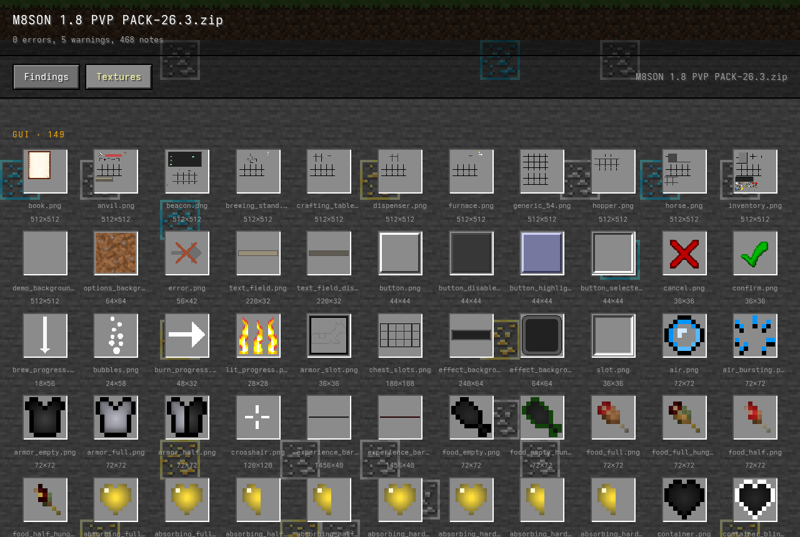
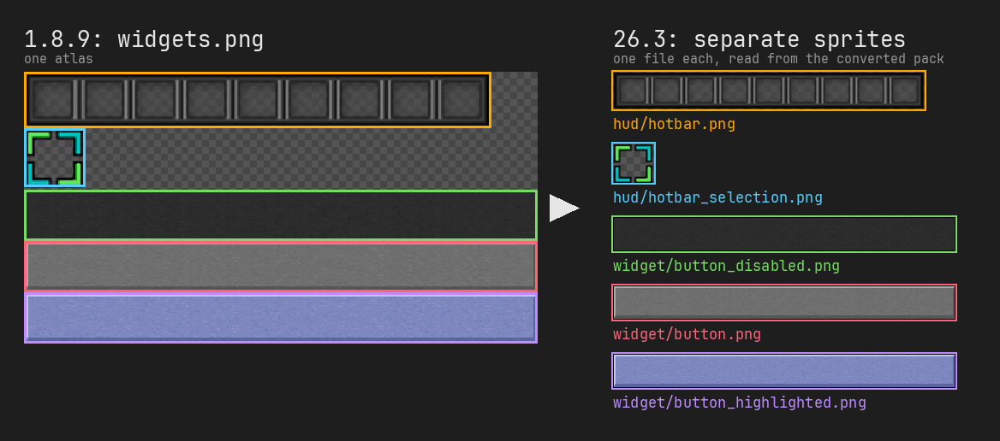
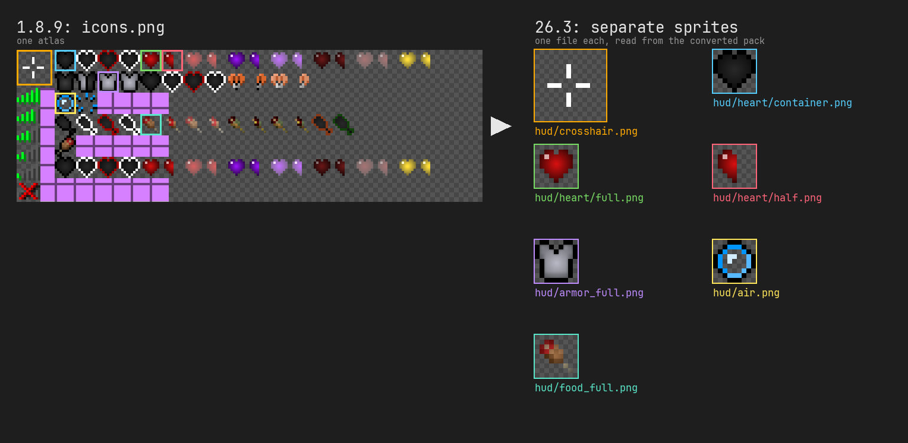
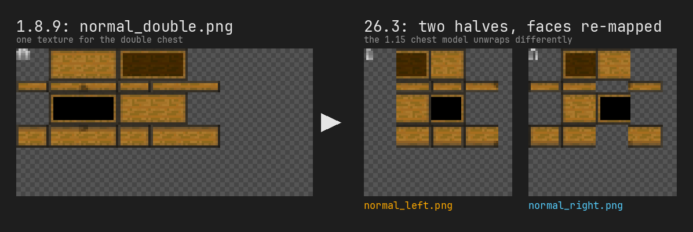
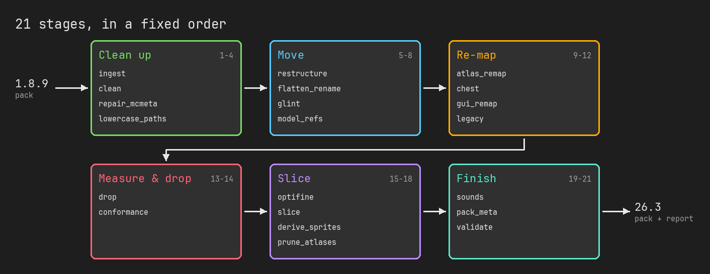
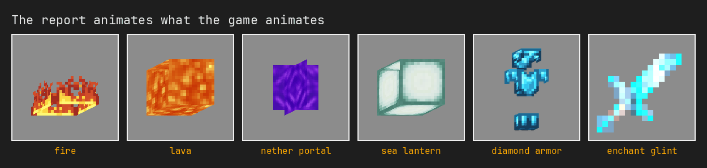
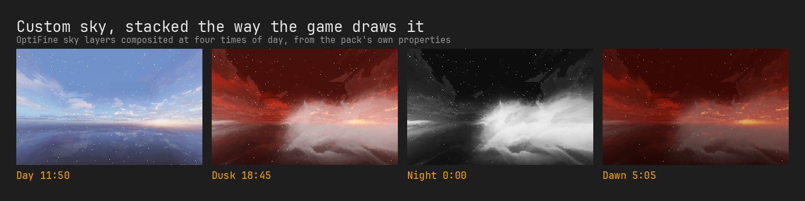
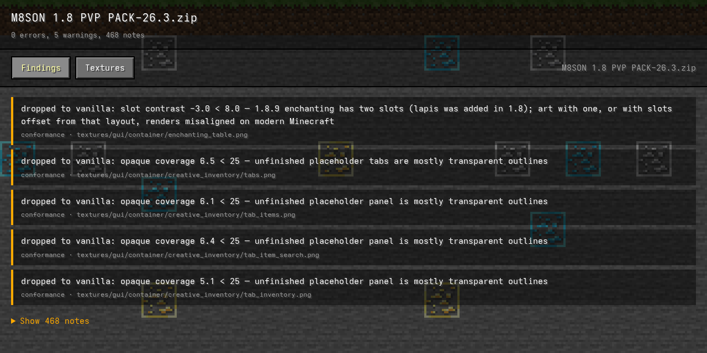

# mc-pack-converter

[](https://github.com/M8SON/mc-pack-converter/actions/workflows/tests.yml)

Converts Minecraft Java **1.8.9** resource packs to **26.1, 26.1.2, 26.2 and 26.3**,
keeping the pack's own art wherever the modern game can still use it.



## Download it

**[Download MCPackConverter.zip](https://github.com/M8SON/mc-pack-converter/releases/latest/download/MCPackConverter.zip)**,
extract it, and **drag your pack's `.zip` onto `MCPackConverter.cmd`.**

You get two files next to your pack:

| File | What it is |
|---|---|
| `YourPack-26.3.zip` | the converted pack |
| `YourPack-26.3-report.html` | opens in your browser and shows everything that was converted |

The first run takes about a minute to install itself. After that it keeps
itself up to date.

<details>
<summary>If Windows complains</summary>

- **"Python is not installed"**: get
  [Python 3.12 from the Microsoft Store](https://apps.microsoft.com/detail/9NCVDN91XZQP)
  (the Store build specifically, since Windows trusts it) and run the file again.
- **"Windows protected your PC"**: click *More info* → *Run anyway*.
- **Why a `.cmd` and not an `.exe`?**
  [Smart App Control](https://support.microsoft.com/en-us/topic/what-is-smart-app-control-285ea03d-fa88-4495-8b65-fe1f7c1ec763)
  blocks unsigned executables outright. So this ships as a Python package
  with a small launcher, which runs `python -m mc_pack_converter.gui` rather
  than a pip-generated `.exe` shim that would be blocked the same way.
</details>

## How it works

1.8.9 packed many sprites into a few big atlases. Modern Minecraft wants one
file per sprite, at new paths and sometimes on a new layout. The converter
cuts, moves and re-maps the pack's own pixels to fit.

**Atlases become separate sprites.** The cuts come from Mojang's own slicer
definitions. These images are from a real run: the left is the source pack,
and the right is read back out of the converted zip.





**Re-modelled textures are re-mapped, not thrown away.** The 1.15 chest model
unwraps differently, and the double chest became two files:





<details>
<summary>All 21 stages</summary>

1. **ingest**: unzips (or copies) the pack, finds the real pack root, and guards against unsafe zip entries.
2. **clean**: removes OS and editor junk (`Thumbs.db`, `.DS_Store`, resource forks, backups).
3. **repair_mcmeta**: fixes `.mcmeta` syntax mistakes, or drops the texture when they can't be fixed. An unparseable `.mcmeta` makes Minecraft drop the whole texture.
4. **lowercase_paths**: lowercases resource paths, since Minecraft silently refuses capitals and spaces.
5. **restructure**: renames `textures/blocks`, `textures/items` and `mcpatcher` to their modern names.
6. **flatten_rename**: applies several hundred 1.8.9 → modern filename renames.
7. **glint**: tiles the enchant glint 2×2 so it keeps the density it was drawn at.
8. **model_refs**: rewrites texture paths in custom models and blockstates to follow the moved files.
9. **atlas_remap**: moves regions of legacy combined textures into the modern layout.
10. **chest**: re-maps chest textures onto the 1.15 chest model and splits double chests.
11. **gui_remap**: shifts GUI elements Mojang repositioned, healing the gap with the pack's own colour.
12. **legacy**: grayscales pre-tinted water for biome tinting, and splits compass/clock strips into frames.
13. **drop**: deletes the few textures no 1.8.9 pack can carry over (the 1.11 horse, the 1.14 villager GUI).
14. **conformance**: measures, per pack, whether the enchanting table and creative tabs still fit, and drops only those that don't.
15. **optifine**: translates connected textures, custom skies and colour properties.
16. **slice**: cuts legacy atlases into one-sprite-per-file using Mojang's slicer definitions.
17. **derive_sprites**: composes the few modern sprites 1.8.9 never drew (such as the offhand slot) from the pack's neighbouring art.
18. **prune_atlases**: deletes the sliced source atlases, which modern Minecraft no longer reads.
19. **sounds**: renames sound files that moved.
20. **pack_meta**: rewrites `pack.mcmeta` to the modern `min_format`/`max_format` schema.
21. **validate**: checks the output for in-game symptoms: missing textures, magenta cubes, squashed GUIs and un-animated strips.
</details>

## The report

Every texture in the converted pack is shown the way the game will use it:
blocks on cubes, armor on a model, and animations moving.



Custom OptiFine skies are composited layer by layer at four times of day:



Anything the converter dropped or changed is listed under **Findings**,
with the number it measured to make the decision:



## Run it on Linux, or from source

Requires Python 3.11+. Dependencies are [Pillow](https://python-pillow.org/)
and numpy.

```
pip install .
python -m mc_pack_converter.gui MyPack.zip               # zip + HTML report
mc-pack-converter convert MyPack.zip                     # zip + Markdown reports
mc-pack-converter convert --target 26.1.2 MyPack.zip     # pick a target version
mc-pack-converter convert --report-only MyPack.zip       # analyse only, write no pack
```

`MyPack` can be a `.zip` or an unpacked folder. The `gui` form writes beside
the pack. `convert` writes to the current directory, or wherever `-o OUT`
says. To update, run `git pull && pip install .`

Verified on Linux with a real 1.8.9 pack. The Windows launcher has not been
retested since the HTML report replaced the window. It runs the same code
path, but that is not a fresh test run.

## Limitations

- **1.8.9 packs only** (`pack_format: 1`). Every coordinate table here is
  derived from the 1.8.9 layout, so a newer pack can be mis-mapped rather than
  just converted badly.
- **The enchanting table** is kept only when the pack draws both of 1.8.9's
  slots where the game expects them. In a 173-pack test corpus, **13 of 142
  keep theirs and 91% fall back to vanilla**. Creative-tab art that is mostly
  transparent placeholders is dropped the same way.
- **8 mob-effect icons** have no 1.8.9 art and use vanilla's.
- **The villager trading GUI** always uses vanilla's: 1.14 redesigned it with
  a panel 1.8.9 has no art for.

Every known issue, and how each was measured, is in
[`docs/known-issues.md`](docs/known-issues.md).

## Credits

- [Mojang's resource-pack slicer](https://github.com/Mojang/slicer), vendored
  under `tools/slicer_src/`, is the source of the GUI-sprite crop table.
- [agentdid127/ResourcePackConverter](https://github.com/agentdid127/ResourcePackConverter)
  is the source of the ported chest remap (`ChestConverter1_15`), water
  grayscale (`WaterConverter1_13`) and compass/clock frame-splitting
  (`CompassConverter1_9`).
